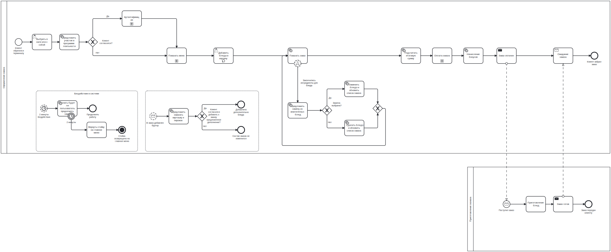
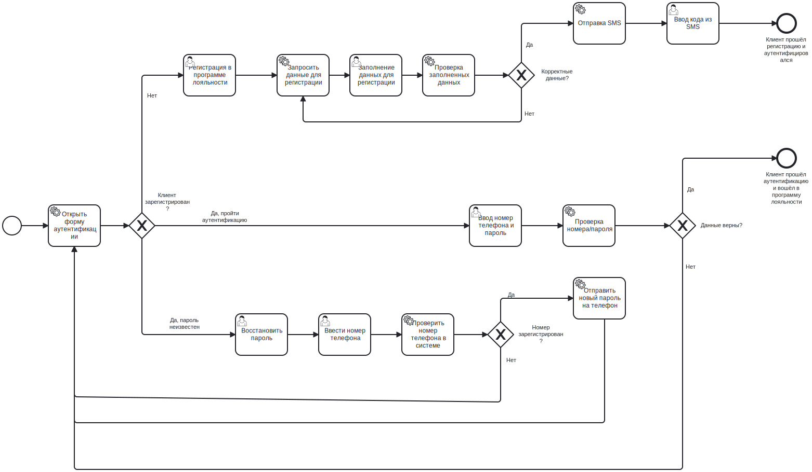
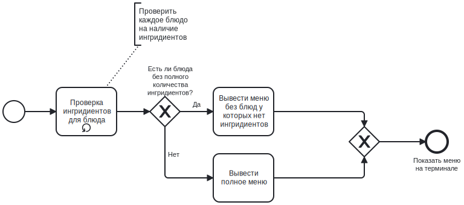

# Описанные бизнес-требования ко всему приложению

## Требования бизнеса

Бизнес-требования к системе автоматизированного ресторана включают:

- **Управление меню:** 
   Система должна позволять посетителям оформлять заказы через веб-сайт, мобильное приложение или терминал в ресторане. Это включает в себя выбор блюд, добавление их в корзину, выбор способа оплаты и получение уведомлений о состоянии заказа.

- **Управление роботами:** 
   Система должна обеспечивать возможность создания, хранения и редактирования объектов меню, включая блюда, напитки, комбо-обеды и специальные предложения. 

- **Управление запасами:** 
   Система должна предоставлять информацию о текущем уровне запасов ингредиентов, сроках годности и необходимости заказа новых запасов. 

- **Управление системой лояльности:** 
   Система должна предоставлять информацию о текущем уровне запасов ингредиентов, сроках годности и необходимости заказа новых запасов. 

- **Управление отзывами:** 
   Система должна давать возможность пользователям оставлять отзывы и оценку по оформленному заказу

### Бизнес-процесс «Заказ блюда в ресторане»

 

### Подпроцесс «Авторизация»

 

### Подпроцесс «Показать меню»

 

### Подпроцесс «Рассчитать скидки»

 
