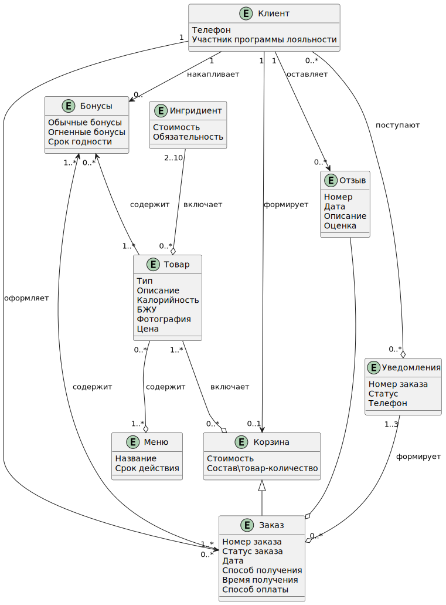

# Спроектированная информационная модель

## Диаграмма классов

## Пояснения к сущностям предметной области

| Сущность                    | Описание                                                                                          |
|---------------------------|---------------------------------------------------------------------------------------------------|
| **Клиент**            | Физическое лицо, которое планирует сделать заказ блюда. |
| **Корзина**           | Список товаров, которые пользователь выбрал для покупки. |
| **Заказ**             | Оформленный и оплаченный перечень блюд и напитков. |
| **Табло**             | Электронное устройство, которое отображает статус и номер оформленного заказа. |
| **Меню**              | Перечень блюд и напитков, доступных для заказа в этом ресторан. |
| **Товар**             | Конкретное блюдо, которое можно заказать. |
| **Способ оплаты**     | Метод, который клиент может использовать для оплаты заказанных блюд и напитков. |
| **Ингридиент**        | Пищевой продукт, который входит в состав блюда. |
| **Отзыв**             | Мнение клиента о конкретном заказке, которое он оставляет в виде текстового комментария. |
| **Уведомления**       | Сообщения, которые отправляются  о событиях. |
| **Табло заказов**     | Электронное устройство на котором отображается номер/статус оформленного заказа. |
