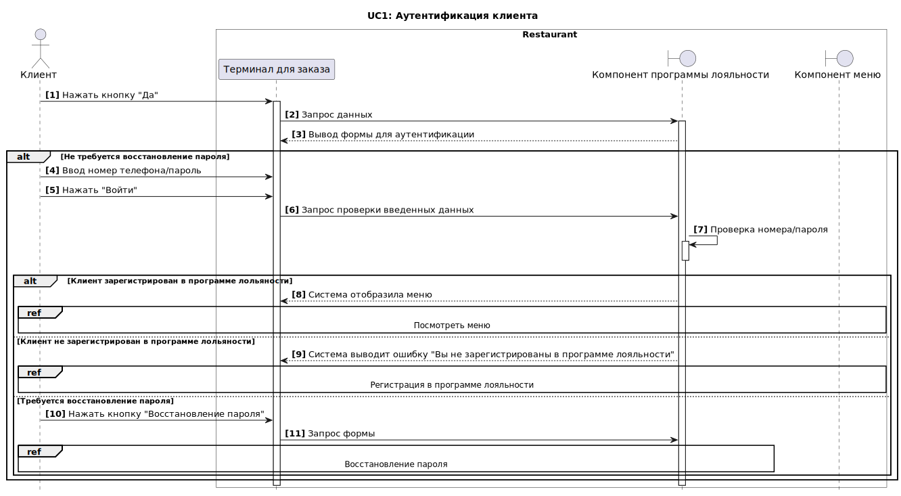
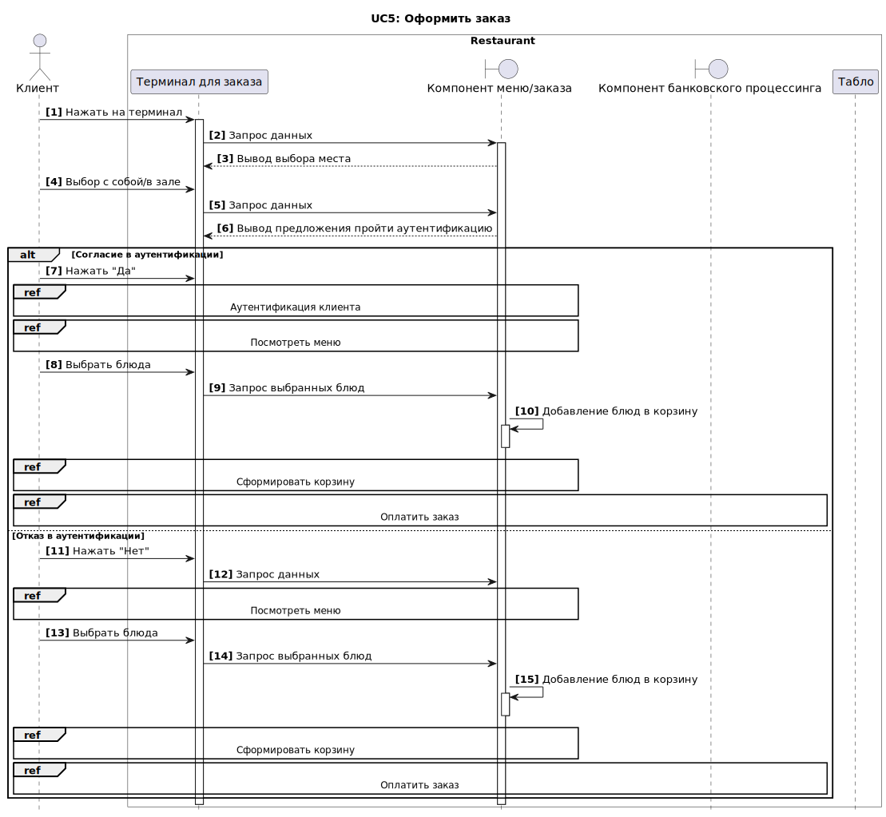
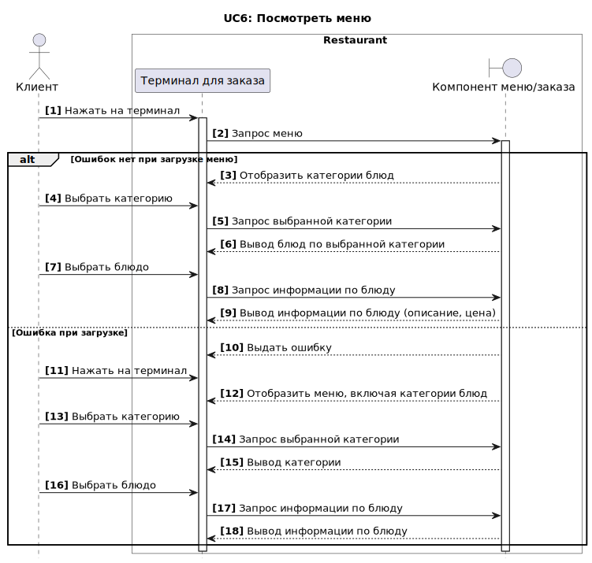
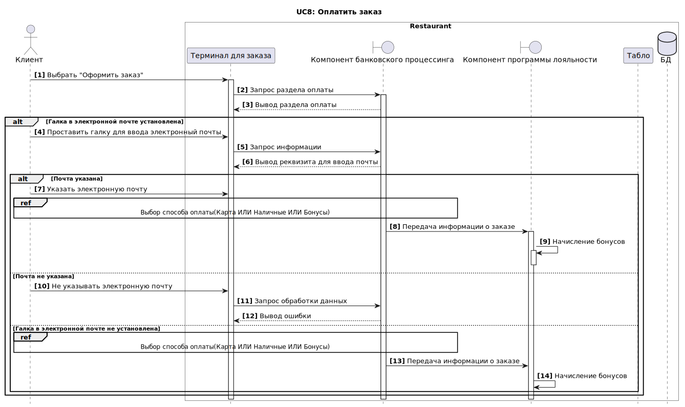

# Задокументированные требования к приложению

## Нефункциональные требования

### Производительность
**`NF1:`** Время загрузки любой страницы системы не должно превышать 3 секунды для пользователей в условиях пиковой нагрузки и 2 секунды в условиях средней нагрузки

**`NF2:`** Система должна обслуживать не менее 100 пользователей одновременно в период пиковой активности с 12:00 до 15:00 по местному времени, не менее 50 пользователей в периоды средней активности, и не менее 10 пользователей в период низкой активности (ночные часы)

### Безопасность
**`NF1:`** Использование протокола HTTPS для всех внешних и внутренних передач данных

**`NF2:`** Все данные пользователей, включая личные данные и информацию о транзакциях, должны передаваться и храниться в зашифрованном виде

### Надежность
**`NF1:`** Система должна быть доступна 99.9% времени для приема и обработки заказов

**`NF2:`** Все операции обработки заказов должны подтверждаться системой в течение 2 секунд

### Совместимость
**`NF1:`** Система должна быть совместима с основными версиями браузеров: Chrome, Firefox, Safari и Edge, последних двух версий.

**`NF2:`** Мобильное приложение должно корректно функционировать на Android и iOS, начиная с версий Android 10 и iOS 13.

### Масштабируемость
**`NF1:`** Возможность увеличения количества обслуживаемых пользователей на 50% при увеличении числа обслуживаемых столов и введении новых роботов

**`NF2:`** Возможность увеличения количества ресторанов через год 2, через 3 года - 4, через 5 лет - 8

### Удобство использования
**`NF1:`** Интерфейс системы должен быть интуитивно понятным и доступным для пользователей

### Доступность
**`NF1:`** Система должна предоставлять пользователям полную информацию о статусе их заказов

### Ремонтопригодность
**`NF1:`** Система должна иметь встроенные средства для быстрого восстановления после сбоев, включая автоматическое резервное копирование данных не реже одного раза в сутки

**`NF2:`** В случае сбоя, система должна восстанавливаться в рабочее состояние не более чем за 2 часа

### Метрики оценки успешности системы

Для обеспечения объективной оценки успешности выполнения требований и общей эффективности функционирования информационной системы "Робот и точка", предлагается внедрение следующих ключевых метрик. Эти метрики позволят не только оценить техническую исполнимость и производительность системы, но также помогут измерить уровень удовлетворенности конечных пользователей и степень достижения бизнес-целей.

**`M1.` Время отклика системы.** Мера времени реакции системы на действия пользователя.  
  **Цель:** Среднее время отклика на запрос пользователя не превышает 2 секунды.

**`M2.` Доступность системы.** Процент времени, когда система оперативно функционирует и доступна пользователям.  
  **Цель:** Обеспечение доступности системы не менее 99.5% общего времени.

**`M3.` Удовлетворенность пользователя.** Мера, отражающая степень соответствия системы ожиданиям и требованиям пользователей.  
  **Цель:** Достижение среднего балла удовлетворенности пользователей не менее 4 из 5.

**`M4.` Соответствие срокам релизов.** Соблюдение заранее установленных сроков выпуска новых версий и обновлений системы.  
  **Цель:** Выпуск 100% релизов строго в соответствии с графиком.

## Функциональные требования
 
 Основные функции системы представлены в виде UseCase диаграммы.

### Общая диаграмма Use Case
 
 

#### UC1. Аутентификация

| Атрибут                    | Описание                                                     |
|----------------------------|------------------------------------|
| ID и название              | UC1: Аутентификация                                                                |
| Описание                   | В рамках посещения ресторана клиентом заказаны блюда.                               |
| Предусловия                | 1. Открыт торговый день (запущен соответствующий режим в системе)  2. Терминал для оформления заказа исправен   |
| Постусловия               | 1. Блюда успешно оформлены клиентом ресторана     2. Получен талон с идентификатором заказа    |
| Основной поток событий     | 1.	Клиент нажимает на терминал.   2.	Система предлагает вариант «С собой» или «В зале».    3.	Клиент выбирает один из предложенных вариантов.   4.	Система предлагает пройти аутентификацию (UC1 – «Аутентификация клиента»).   5.	Система открывает для просмотра меню (UC6 – «Посмотреть меню»).   6.	Клиент выбирает блюда.   7. Система добавляет выбранные блюда в корзину (UC7 – «Сформировать корзину»).   8. Клиент нажимает на кнопку «Оплатить» (UC8 – «Оплатить заказ»).   9.	Система показывает номер идентификатора заказа и выдает талон.   10.	Клиент получает заказ (UC12 – «Получить заказ»). |
| Альтернативный поток | 4.а. Отказ от аутентификации:    1. Система проверяет номер в базе данных – номер зарегистрирован.   2. Система переходит на шаг 5 
| Исключение 1                 | Клиент не совершает никаких действий на терминале:   1.	Система после 2х минут отсутствия реакции выдает сообщение «Вы ещё с нами?»   2.	Система после 2х минут отсутствия реакции на сообщение возвращает в главное меню                                             |
| Исключение 2                 | Клиент передумал оформлять заказ:   1.	Клиент нажимает на кнопку «Отмена»   2.	Система выводит сообщение «Вы точно хотите отменить заказ?»   3.	Клиент нажимает «Да»   4.	Система возвращает в главное меню                                                   |
| Диаграмма                  |                   |
| Макеты                     | [protUC1](assets/images/protUC1.PNG) |

### Описание Use Case

#### UC5. Оформить заказ

| Атрибут                    | Описание                                                     |
|----------------------------|------------------------------------|
| ID и название              | UC5: Оформить заказ                                                                |
| Описание                   | В рамках посещения ресторана клиентом заказаны блюда.                               |
| Предусловия                | 1. Открыт торговый день (запущен соответствующий режим в системе)  2. Терминал для оформления заказа исправен   |
| Постусловия               | 1. Блюда успешно оформлены клиентом ресторана     2. Получен талон с идентификатором заказа    |
| Основной поток событий     | 1.	Клиент нажимает на терминал.   2.	Система предлагает вариант «С собой» или «В зале».    3.	Клиент выбирает один из предложенных вариантов.   4.	Система предлагает пройти аутентификацию (UC1 – «Аутентификация клиента»).   5.	Система открывает для просмотра меню (UC6 – «Посмотреть меню»).   6.	Клиент выбирает блюда.   7. Система добавляет выбранные блюда в корзину (UC7 – «Сформировать корзину»).   8. Клиент нажимает на кнопку «Оплатить» (UC8 – «Оплатить заказ»).   9.	Система показывает номер идентификатора заказа и выдает талон.   10.	Клиент получает заказ (UC12 – «Получить заказ»). |
| Альтернативный поток | 4.а. Отказ от аутентификации:    1. Система проверяет номер в базе данных – номер зарегистрирован.   2. Система переходит на шаг 5 
| Исключение 1                 | Клиент не совершает никаких действий на терминале:   1.	Система после 2х минут отсутствия реакции выдает сообщение «Вы ещё с нами?»   2.	Система после 2х минут отсутствия реакции на сообщение возвращает в главное меню                                             |
| Исключение 2                 | Клиент передумал оформлять заказ:   1.	Клиент нажимает на кнопку «Отмена»   2.	Система выводит сообщение «Вы точно хотите отменить заказ?»   3.	Клиент нажимает «Да»   4.	Система возвращает в главное меню                                                   |
| Диаграмма                  |                   |
| Макеты                     | [protUC1](assets/images/protUC1.PNG) |

#### UC6. Посмотреть меню

| Атрибут                    | Описание                                                     |
|----------------------------|------------------------------------|
| ID и название              | UC6: Посмотреть меню                                                                |
| Описание                   | Пользователь может просматривать текущее меню ресторана                               |
| Предусловия                | Терминал должен быть включен и функционировать. Меню должно быть актуальным и загруженным в систему управления меню.|
| Постусловия               | Посетитель получает необходимую информацию о меню.    |
| Основной поток событий     | 1.	Клиент проходит этап аутентификации   2.	Терминал загружает и отображает меню, включая категории блюд (например, закуски, основные блюда, десерты) и акции.    3.	Клиент просматривает различные категории и блюда.   4.	Система предоставляет детальную информацию по выбранному блюду   5.	Клиент может вернуться к списку категорий или завершить просмотр и выйти из системы |
| Альтернативный поток | 2.а. Техническая проблема при загрузке меню:    1.	Терминал пытается загрузить меню, но процесс завершается с ошибкой из-за технической проблемы (например, отсутствие связи с сервером).   2. Терминал отображает сообщение об ошибке: "Извините, не удалось загрузить меню. Пожалуйста, попробуйте позже или обратитесь к нашему персоналу за помощью.".   3.	Посетитель может либо попытаться повторить запрос, либо обратиться к персоналу ресторана.
| Исключение 1                 | Клиент не совершает никаких действий на терминале:   1.	Система после 2х минут отсутствия реакции выдает сообщение «Вы ещё с нами?»   2.	Система после 2х минут отсутствия реакции на сообщение возвращает в главное меню                                             |
| Исключение 2                 | Клиент передумал оформлять заказ:   1.	Клиент нажимает на кнопку «Отмена»   2.	Система выводит сообщение «Вы точно хотите отменить заказ?»   3.	Клиент нажимает «Да»   4.	Система возвращает в главное меню                                                   |
| Диаграмма                  |                   |
| Макеты                     | [protUC1](assets/images/protUC1.PNG) |

#### UC8. Оплатить заказ

| Атрибут                    | Описание                                                     |
|----------------------------|------------------------------------|
| ID и название              | UC8: Оплатить заказ                                                                |
| Описание                   | Позволяет пользователю оплатить сформированный заказ                             |
| Предусловия                | Клиент уже выбрал блюда и добавил их в корзину.|
| Постусловия               | Заказ успешно оформлен. |
| Основной поток событий     | 1.	Клиент попадает в раздел оплаты.   2.	Система выводит раздел с оплатой.    3.	Клиент выбирает способ оплаты (UC9 Оплата картой, UC10 Оплата наличными, UC11 Оплата бонусами).   4.	Клиент проставляет галку в поле «Электронный чек».   5.	Система открывает поле для ввода электронной почты.   6.	Клиент вводит электронную почту и нажимает кнопку «Оплатить заказ».   7.	Система обрабатывает транзакцию и при успешной оплате выдает подтверждение заказа и чек. |
| Альтернативный поток 1 | 5.а. Не указана электронная почта:    1.	Клиент не вводит электронную почту и нажимает кнопку «Оплатить заказ».   2.	Система выдает сообщение «Не указана электронная почта».   3.	Система переходит на шаг 1.
| Альтернативный поток 2 | 6.а. Проблема с платежной транзакцией:    1.	Система пытается обработать транзакцию, но процесс завершается с ошибкой (например, проблемы с банковской картой или сетью).   2. Система отображает сообщение об ошибке: "Ошибка при обработке платежа. Пожалуйста, попробуйте снова или выберите другой способ оплаты.".    3.	Система переходит на шаг 2.
| Исключение 1                 | Клиент не совершает никаких действий на терминале:   1.	Система после 2х минут отсутствия реакции выдает сообщение «Вы ещё с нами?»   2.	Система после 2х минут отсутствия реакции на сообщение возвращает в главное меню                                             |
| Исключение 2                 | Клиент передумал оформлять заказ:   1.	Клиент нажимает на кнопку «Отмена»   2.	Система выводит сообщение «Вы точно хотите отменить заказ?»   3.	Клиент нажимает «Да»   4.	Система возвращает в главное меню                                                   |
| Диаграмма                  |                   |
| Макеты                     | [protUC1](assets/images/protUC1.PNG) |

