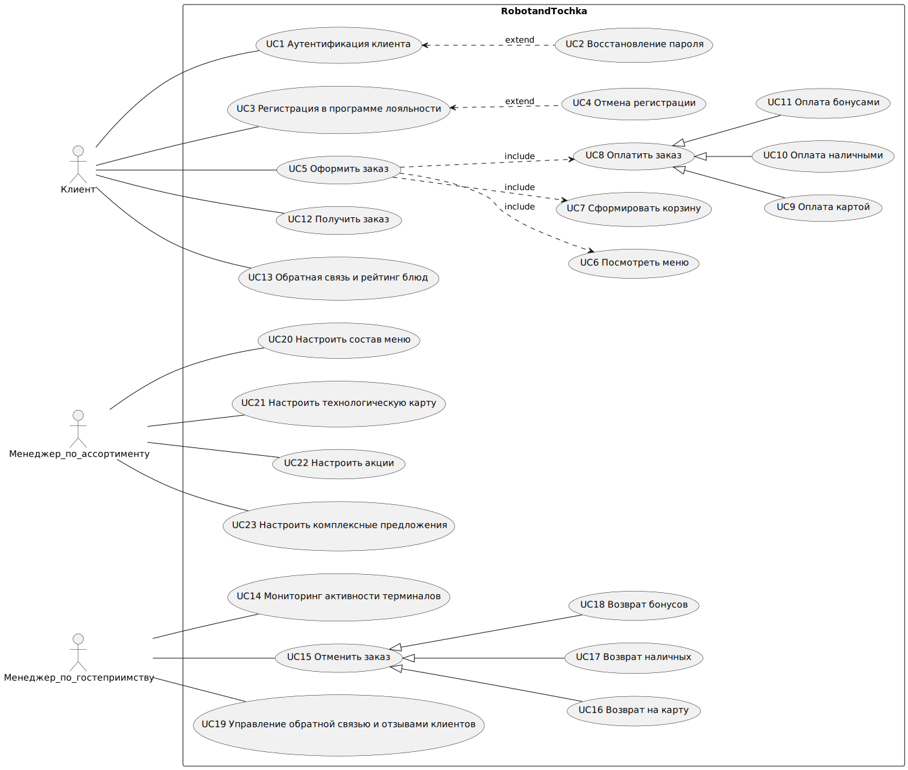
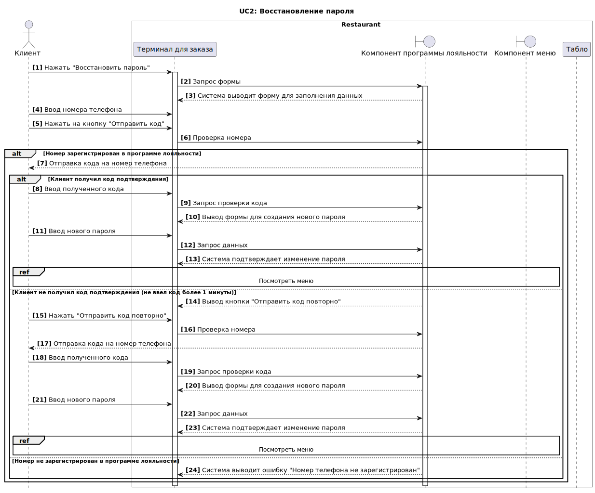
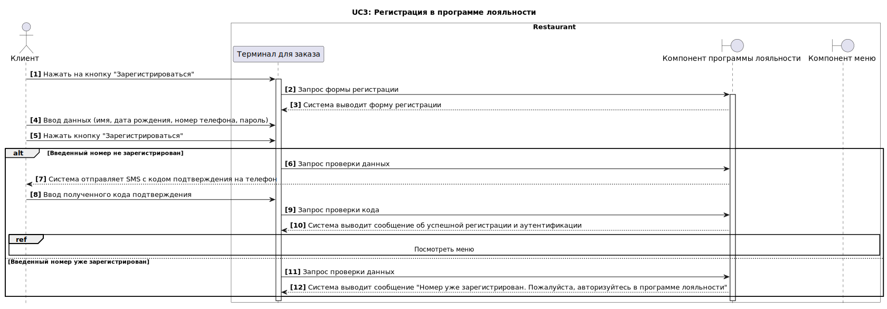
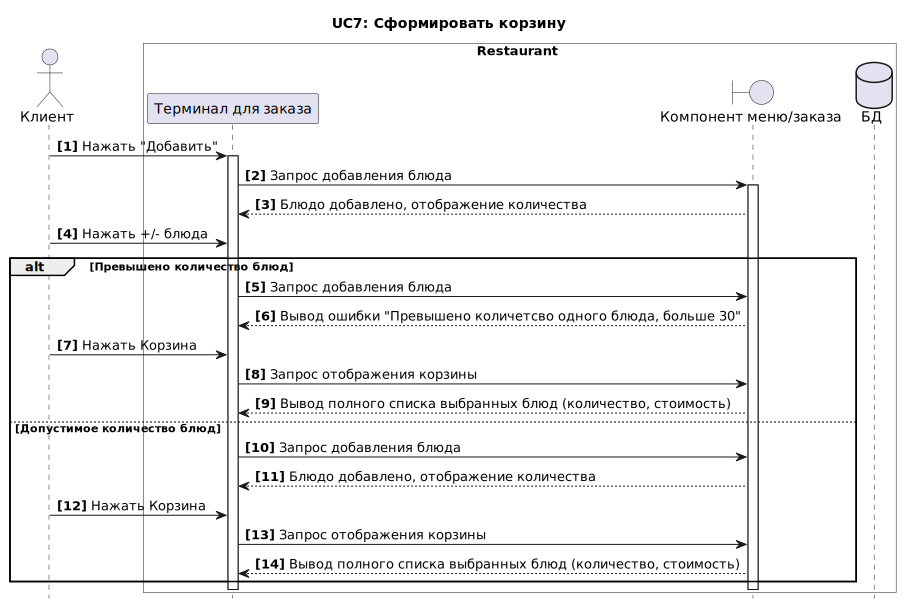
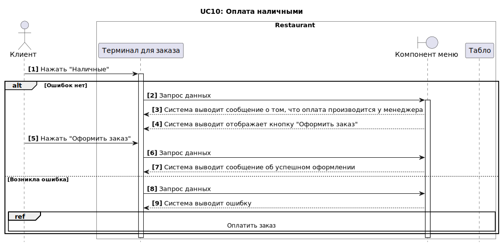
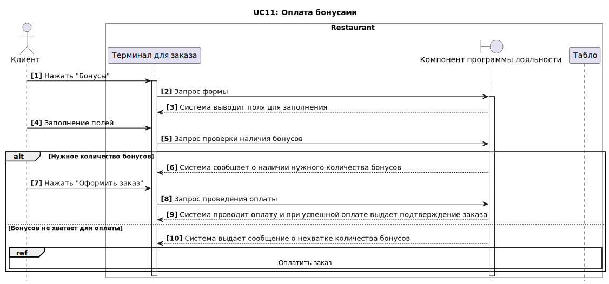
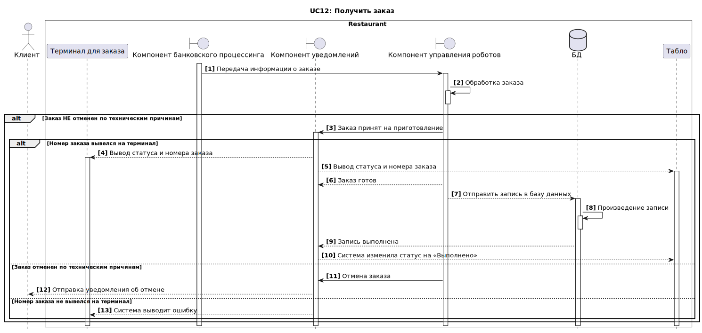

# Задокументированные требования к приложению

## Нефункциональные требования

### Производительность
**`NF1:`** Время загрузки любой страницы системы не должно превышать 3 секунды для пользователей в условиях пиковой нагрузки и 2 секунды в условиях средней нагрузки.
 
Пиковая нагрузка - период, когда активность покупателей достигает своего максимума. Пример: обеденное время. (более 300 заказов в час)
 
Средняя нагрузка - период, когда активность покупателей находится на среднем уровне. В этот период нагрузка не слишком высока, но и не минимальна. (230 заказов в час)
 
Низкая нагрузка - период, когда активность покупателей минимальная. Пример: Ночные часы (менее 200 заказов в час)

**`NF2:`** Система должна обслуживать не менее 100 пользователей одновременно в период пиковой активности с 12:00 до 15:00 по местному времени, не менее 50 пользователей в периоды средней активности, и не менее 10 пользователей в период низкой активности (ночные часы)

### Безопасность
**`NF1:`** Использование протокола HTTPS для всех внешних и внутренних передач данных

**`NF2:`** Все данные пользователей, включая личные данные и информацию о транзакциях, должны передаваться и храниться в зашифрованном виде

### Надежность
**`NF1:`** Система должна быть доступна 99.9% времени для приема и обработки заказов

**`NF2:`** Все операции обработки заказов должны подтверждаться системой в течение 2 секунд

### Совместимость
**`NF1:`** Система должна быть совместима с основными версиями браузеров: Chrome, Firefox, Safari и Edge, последних двух версий.

**`NF2:`** Мобильное приложение должно корректно функционировать на Android и iOS, начиная с версий Android 10 и iOS 13.

### Масштабируемость
**`NF1:`** Возможность увеличения количества обслуживаемых пользователей на 50% при увеличении числа обслуживаемых столов и введении новых роботов

**`NF2:`** Возможность увеличения количества ресторанов через год 2, через 3 года - 4, через 5 лет - 8

### Удобство использования
**`NF1:`** Интерфейс системы должен быть интуитивно понятным и доступным для пользователей

### Доступность
**`NF1:`** Система должна предоставлять пользователям полную информацию о статусе их заказов

### Ремонтопригодность
**`NF1:`** Система должна иметь встроенные средства для быстрого восстановления после сбоев, включая автоматическое резервное копирование данных не реже одного раза в сутки

**`NF2:`** В случае сбоя, система должна восстанавливаться в рабочее состояние не более чем за 2 часа

### Метрики оценки успешности системы

Для обеспечения объективной оценки успешности выполнения требований и общей эффективности функционирования информационной системы "Робот и точка", предлагается внедрение следующих ключевых метрик. Эти метрики позволят не только оценить техническую исполнимость и производительность системы, но также помогут измерить уровень удовлетворенности конечных пользователей и степень достижения бизнес-целей.

**`M1.` Время отклика системы.** Мера времени реакции системы на действия пользователя.  
  **Цель:** Максимальное время отклика на запрос пользователя не превышает 3 секунды в условиях пиковой нагрузки.

**`M2.` Доступность системы.** Процент времени, когда система оперативно функционирует и доступна пользователям.  
  **Цель:** Обеспечение доступности системы не менее 99.5% общего времени.

**`M3.` Удовлетворенность пользователя.** Мера, отражающая степень соответствия системы ожиданиям и требованиям пользователей.  
  **Цель:** Достижение среднего балла удовлетворенности пользователей не менее 4 из 5.

**`M4.` Соответствие срокам релизов.** Соблюдение заранее установленных сроков выпуска новых версий и обновлений системы.  
  **Цель:** Выпуск 100% релизов строго в соответствии с графиком.

## Функциональные требования
 
 Основные функции системы представлены в виде UseCase диаграммы.

### Общая диаграмма Use Case
 
 

### Описание Use Case

#### **`UC1`** Аутентификация клиента 

| Атрибут                    | Описание                                                     |
|----------------------------|------------------------------------|
| ID и название              | UC1: Аутентификация клиента                                                               |
| Описание                   | Позволяет клиенту ресторана войти в учетную запись.                               |
| Предусловия                | 1. Клиент не аутентифицирован и согласился пройти аутентификацию  |
| Постусловия                | 1. Пользователь успешно прошёл аутентификацию   |
| Основной поток событий     | 1. Клиент нажал кнопку "Да"   2. Система открывает форму для аутентификации   3.	Клиент вводит номер телефона/пароль   4.	Клиент нажимает кнопку "Войти"   5. Система проверяет введенные данные.   6. Клиент успешно аутентифицировался.   7.	Система отобразила меню |
| Альтернативный поток 1     | 1.а. Восстановление пароля:    1. Клиент нажимает кнопку "Восстановление пароля"    2. UC2 - Восстановление пароля   3. Система переходит на шаг 3
| Альтернативный поток 2     | 5.а. Клиент не зарегистрирован:    1. Система выводит ошибку "Вы не зарегистрированы в программе лояльности"   2. Система переходит UC3 - Регистрация в программе лояльности
| Исключение                 | [Исключения](req.md#_13)                                            |
| Диаграмма                  |                   |

#### **`UC2`** Восстановление пароля

| Атрибут                    | Описание                                                     |
|----------------------------|------------------------------------|
| ID и название              | UC2: Восстановление пароля                                                              |
| Описание                   | В рамках аутентификации предоставление возможности восстановить пароль.                               |
| Предусловия                | 1. Клиент забыл пароль и находится в разделе аутентификации |
| Постусловия                | 1. Клиент успешно получил новый пароль |
| Основной поток событий     | 1.	Клиент нажимает на кнопку "Восстановить пароль"   2.	Система выводит форму для заполнения данных.    3.	Клиент вводит номер телефона и нажимает на кнопку "Отправить код"   4.	Система получает запрос и проверяет номер телефона   5. Система отправляет код на телефон   6. Клиент вводит полученный код   7. Система отображает форму для создания нового пароля   8. Клиент вводит новый пароль   9. Система подтверждает изменение пароля   10. Система открывает меню |
| Альтернативный поток 1 | 2.а. Клиент передумал восстанавливать пароль:    1. Клиент нажимает на кнопку "Продолжить без участия в программе лояльности"   2. Система переходит на шаг 9 
| Альтернативный поток 2 | 4.а. Номер телефона не зарагистрирован:    1. Система проверяет номер телефона   2. Система выводит ошибку "Номер телефона не зарегистрирован"   3. Система переходит на шаг 2
| Исключение                 | [Исключения](req.md#_13)                                            |
| Диаграмма                  |                   |

[Исключения](req.md#_13)

#### **`UC3`** Регистрация в программе лояльности

| Атрибут                    | Описание                                                     |
|----------------------------|------------------------------------|
| ID и название              | UC3: Регистрация в программе лояльности                                                              |
| Описание                   | Позволяет клиентам создать учетную запись в системе.                               |
| Предусловия                | 1. Клиент не должен быть зарегистрирован в системе |
| Постусловия                | 1. Клиент успешно зарегистрирован и может войти в систему. |
| Основной поток событий     | 1.	Клиент нажимает на кнопку "Зарегистрироваться"   2.	Система открывает форму регистрации.   3. Клиент вводит данные (имя, дата рождения, номер телефона, пароль).   4. Клиент нажимает на кнопку "Зарегистрироваться".   5. Система обрабатывает данные   6.	Система отправляет SMS с кодом подтверждения на введенный номер телефона    7.	Клиент вводит код подтверждения из SMS   8. Система проверяет код и регистрирует пользователя.   9. Клиент успешно аутентифицирован для участия в программе лояльности.|
| Альтернативный поток | 5.а. Номер телефона уже зарегистрирован:    1. Система проверяет номер в базе данных – номер зарегистрирован.   2. Система отображает сообщение об ошибке: «Этот номер телефона уже используется. Пожалуйста, авторизуйтесь в программе лояльности».   Система переходит в UC1 - Аутентификация клиента
| Исключение                  | [Исключения](req.md#_13)                                             |
| Диаграмма                  |                   |

#### **`UC4`** Отказ от регистрации

| Атрибут                    | Описание                                                     |
|----------------------------|------------------------------------|
| ID и название              | UC4: Отказ от регистрации                                                            |
| Описание                   | В рамках регистрации возможность отменить её и перейти в меню.                               |
| Предусловия                | 1. Клиент находится на форме регистрации  |
| Постусловия                | 1. Клиент успешно отменил регистрацию в программе лояльности    |
| Основной поток событий     | 1.	Система отобразила форму для регистрации   2. Клиент вводит данные (имя, дата рождения, номер телефона, пароль)  	3. Клиент нажимает на кнопку "Продолжить без участия в программе лояльности"    4.	Система выводит сообщение для подтверждения действия   5.	Клиент нажимает "Да"   6. Система отображает меню|
| Альтернативный поток | 3.а. Прекращение отказа от регистрации:    1. Клиент нажимает "Нет".   2. Система переходит в UC3 - Регистрация в программе лояльности
| Исключение                 | [Исключения](req.md#_13)                                             |
| Диаграмма                  |                   |

#### **`UC5`** Оформить заказ

| Атрибут                    | Описание                                                     |
|----------------------------|------------------------------------|
| ID и название              | UC5: Оформить заказ                                                                |
| Описание                   | В рамках посещения ресторана клиентом заказаны блюда.                               |
| Предусловия                | 1. Открыт торговый день (запущен соответствующий режим в системе)  2. Терминал для оформления заказа исправен   |
| Постусловия                | 1. Заказ перешёл в раздел оплаты   |
| Основной поток событий     | 1.	Клиент нажимает на терминал.   2.	Система предлагает вариант «С собой» или «В зале».    3.	Клиент выбирает один из предложенных вариантов.   4.	Система предлагает пройти аутентификацию.   5. Нажать кнопку "Да" (UC1 – «Аутентификация клиента»)   6.	Система открывает для просмотра меню (UC6 – «Посмотреть меню»).   7.	Клиент выбирает блюда.   8. Система добавляет выбранные блюда в корзину (UC7 – «Сформировать корзину»).   9. Клиент нажимает на кнопку «Оплатить» (UC8 – «Оплатить заказ»). |
| Альтернативный поток       | 5.а. Отказ от аутентификации:    1. Нажать кнопку "Нет".   2. Система переходит на шаг 6 
| Исключение                 | [Исключения](req.md#_13)                                             |
| Диаграмма                  |                   |

#### **`UC6`** Посмотреть меню

| Атрибут                    | Описание                                                     |
|----------------------------|------------------------------------|
| ID и название              | UC6: Посмотреть меню                                                                |
| Описание                   | Клиент может просматривать текущее меню ресторана                               |
| Предусловия                | Терминал должен быть включен и функционировать. Меню должно быть актуальным и загруженным в систему управления меню.|
| Постусловия                | Посетитель получает необходимую информацию о меню.    |
| Основной поток событий     | 1.	Клиент проходит этап аутентификации   2.	Терминал загружает и отображает меню, включая категории блюд (например, закуски, основные блюда, десерты) и акции.    3.	Клиент выбирает категорию блюд.   4.	Система отображает блюда со стоимостью по выбранной категории   5. Клиент выбирает блюдо   6. Система открывает карточку блюда с выводом информации (описание, цена). |
| Альтернативный поток | 2.а. Техническая проблема при загрузке меню:    1.	Терминал пытается загрузить меню, но процесс завершается с ошибкой из-за технической проблемы (например, отсутствие связи с сервером).   2. Терминал отображает сообщение об ошибке: "Извините, не удалось загрузить меню. Пожалуйста, попробуйте позже или обратитесь к нашему персоналу за помощью.".   3.	Посетитель может либо попытаться повторить запрос, либо обратиться к персоналу ресторана.
| Исключение                 | [Исключения](req.md#_13)                                             |
| Диаграмма                  |                   |

#### **`UC7`** Сформировать корзину

| Атрибут                    | Описание                                                     |
|----------------------------|------------------------------------|
| ID и название              | UC7: Сформировать корзину                                                               |
| Описание                   | Формирование корзины для последующей оплаты заказа                              |
| Предусловия                | Меню и данные о блюдах должны быть актуальными и доступными в системе управления меню.|
| Постусловия                | В корзину добавлены все выбранные блюда с учетом настроек и количества.    |
| Основной поток событий     | 1.	Клиент нажимает "Добавить"    2. Система выводит возможность увеличить количество выбранного блюда   3.	Клиент регулирует количество нажимая иконку «+» и «-»   4.	Система добавляет блюдо в корзину   5.	Клиент нажимает на раздел «Корзина»   6. Система выводит полный список добавленных блюд с количество, суммой каждого блюда и общей стоимостью заказа |
| Альтернативный поток | 3.а. Пользователь выбрал максимальное количество блюда:    1.	Клиент выбрал в размере 30 штук одного блюда   2. Система делает неактивным иконку «+» по данному блюду 
| Исключение                 | [Исключения](req.md#_13)                                            |
| Диаграмма                  |                   |

#### **`UC8`** Оплатить заказ

| Атрибут                    | Описание                                                     |
|----------------------------|------------------------------------|
| ID и название              | UC8: Оплатить заказ                                                                |
| Описание                   | Позволяет пользователю оплатить сформированный заказ                             |
| Предусловия                | Клиент попадает в раздел оплаты.|
| Постусловия                | Заказ успешно оформлен. |
| Основной поток событий     | 1.	Клиент попадает в раздел оплаты.   2.	Система выводит раздел с оплатой.    3.	Клиент проставляет галку в поле «Электронный чек».   4.	Система открывает поле для ввода электронной почты.   5.	Клиент вводит электронную почту.   6.	Клиент выбирает способ оплаты (UC9 Оплата картой ИЛИ UC10 Оплата наличными ИЛИ UC11 Оплата бонусами).   7. Система отобразила номер заказа на терминале и табло   8. Система отправила информацию о заказе роботам   9. Передача информации о готовности блюд   10. Система изменила статус на «Выполнено»   11. Клиента забрал заказ|
| Альтернативный поток 1 | 5.а. Не указана электронная почта:    1.	Клиент не вводит электронную почту и переходит к выбору способа оплаты   2.	Система выдает сообщение «Не указана электронная почта».   3.	Система переходит на шаг 1.
| Альтернативный поток 2 | 3.а. Не выбран электронная почта:    1.	Клиент не проставляет галку в поле "Электронный чек"   2. Система не выводит поле для ввода электронного чека.
| Исключение                 | [Исключения](req.md#_13)                                             |
| Диаграмма                  |                   |

#### **`UC9`** Оплата картой

| Атрибут                    | Описание                                                     |
|----------------------------|------------------------------------|
| ID и название              | UC9: Оплата картой                                                               |
| Описание                   | Позволяет выбрать способ оплаты картой                            |
| Предусловия                | Клиент находится в разделе оплаты.|
| Постусловия                | Клиент успешно выбрал способ оплаты картой и указал её данные. |
| Основной поток событий     | 1.	Клиент нажимает на кнопка "Карта".   2.	Система выводит поля для заполнения    3.	Клиент заполняет реквизиты карты.   4.	Система проверяет корректность заполненных данных   5.	Система сообщает о корректно заполненных реквизитах карты.   6. Клиент нажимает кнопку «Оплатить заказ».   7.	Система обрабатывает транзакцию и при успешной оплате выдает подтверждение заказа. ||
| Альтернативный поток | 3.а. Не корретный номер карты:    1.	Клиент заполняет реквизиты карты   2.	Система проверяет корректность заполненных данных.   3.	Система выдает ошибку о некорректном номере карты   4. Система переходит в UC8 - Оплатить заказ
| Альтернативный поток 2 | 7.а. Проблема с платежной транзакцией:    1.	Система пытается обработать транзакцию, но процесс завершается с ошибкой (например, проблемы с банковской картой или сетью).   2. Система отображает сообщение об ошибке: "Ошибка при обработке платежа. Пожалуйста, попробуйте снова или выберите другой способ оплаты.".    3. Система переходит в UC8 - Оплатить заказ
| Исключение                 | [Исключения](req.md#_13)                                            |
| Диаграмма                  |                   |

#### **`UC10`** Оплата наличными

| Атрибут                    | Описание                                                     |
|----------------------------|------------------------------------|
| ID и название              | UC10: Оплата наличными                                                                |
| Описание                   | Позволяет выбрать способ оплаты наличными                           |
| Предусловия                | Клиент находится в разделе оплаты.|
| Постусловия                | Клиент успешно выбрал способ оплаты наличными и оформил заказ |
| Основной поток событий     | 1.	Клиент нажимает на кнопка "Наличные".   2.	Система выводит сообщение о том, что оплата производится у менеджера.    3.	Система выводит отображает кнопку "Оформить заказ"   4. Клиент нажимает кнопку "Оформить заказ"   5. Заказ оформлен, требуется оплатить|
| Альтернативный поток | 1.а. Возникает ошибка при выборе способа оплаты:    1.	Система выводит сообщение о том, что оплата наличными временно невозможна   2.		Система переходит в UC8 - Оплатить заказ
| Исключение                 | [Исключения](req.md#_13)                                             |
| Диаграмма                  |                   |

#### **`UC11`** Оплата бонусами

| Атрибут                    | Описание                                                     |
|----------------------------|------------------------------------|
| ID и название              | UC11: Оплата бонусами                                                                |
| Описание                   | Позволяет выбрать способ оплаты бонусами                            |
| Предусловия                | Клиент находится в разделе оплаты.|
| Постусловия                | Клиент успешно выбрал способ оплаты бонусами и оформил заказ |
| Основной поток событий     | 1.	Клиент нажимает на кнопка "Бонусы".   2.	Система выводит поле списания бонусов    3.	Клиент указывает количество бонусов для списания   4.	Система проверяет наличие бонусов   5.	Система сообщает о наличии нужного количества бонусов для оплаты.   6. Клиент нажимает кнопку "Оформить заказ"   7. Система проводит оплату   8. Заказ оформлен |
| Альтернативный поток | 4.а. Недостаточное количество бонусов для оплаты:    1.	Система выдает сообщение о нехватке количества бонусов, предлагает выбрать другой способ оплаты   2.		Система переходит в UC8 - Оплатить заказ
| Исключение                 | [Исключения](req.md#_13)                                            |
| Диаграмма                  |                   |

#### **`UC12`** Получить заказ

| Атрибут                    | Описание                                                     |
|----------------------------|------------------------------------|
| ID и название              | UC12: Получить заказ                                                               |
| Описание                   | Получение оплаченного заказа                            |
| Предусловия                | Клиент оформил и оплатил заказ.|
| Постусловия                | Клиент получил свой заказ. |
| Основной поток событий     | 1. Успешное проведение оплаты   2.	Система отобразила номер заказа на терминале   3.	Система выдала чек   4. Система отправила информацию о заказе роботам   5.	Система отобразила номер заказа и статус на табло   6.	Роботы передали информацию о готовности блюд   7. Система изменила статус на «Выполнено»   8.	Клиент забрал свой заказ на стойке получения заказов |
| Альтернативный поток | 1.а. Система не отображает номер заказа на терминале:    1.	Номер заказа не отображается   2.	Система выводит сообщение на табло: «Ошибка, терминал не работает по техническим причинам, обратитесь к менеджеру»
| Исключение                 | [Исключения](req.md#_13)                                            |
| Диаграмма                  |                   |

#### **`UC13`** Обратная связь по заказам

| Атрибут                    | Описание                                                     |
|----------------------------|------------------------------------|
| ID и название              | UC13: Обратная связь по заказам                                                              |
| Описание                   | Позволяет клиенту оставить отзыв об оплаченном заказе                             |
| Предусловия                | Клиент прошёл аутентификацию, успешно выполнил и оплатил заказ.|
| Постусловия                | Клиент  успешно оставил отзыв и оценку по заказу |
| Основной поток событий     | 1.	Клиент открывает раздел "Отзывы"   2.	Система выводит список сделанных заказов.    3.	Клиент выбирает нужный заказ.   4.	Система выводит форму для отзыва и оценки.   5.	Клиент заполняет данные и нажимает кнопку "Отправить"   6.	Система проверяет корретность данных.   7.	Система выдает сообщение о размещении отзыва. |
| Альтернативный поток | 5.а. Некорретные данные:    1.	Клиент не заполнил Отзыв и нажимает кнопку "Отправить"   2.	Система проверяет корретность данных.   3.	Система выдает ошибку.   Система переходит на шаг 4
| Исключение                 | [Исключения](req.md#_13)                                            |
| Диаграмма                  |                   |

### **`Исключения`**

| Атрибут                      | Описание                                                     |
|------------------------------|------------------------------------|
| Исключение 1                 | Клиент не совершает никаких действий на терминале:   1.	Система после 2х минут отсутствия реакции выдает сообщение «Вы ещё с нами?»   2.	Система после 2х минут отсутствия реакции на сообщение возвращает в главное меню                                             |
| Исключение 2                 | Клиент передумал оформлять заказ:   1.	Клиент нажимает на кнопку «Отмена»   2.	Система выводит сообщение «Вы точно хотите отменить заказ?»   3.	Клиент нажимает «Да»   4.	Система возвращает в главное меню  
