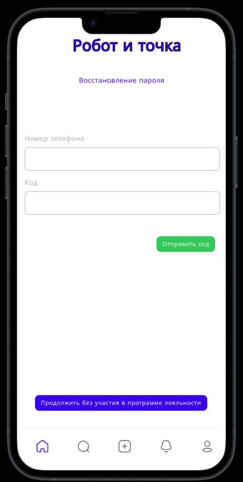

# Пользовательский интерфейс приложения

## Вайрфреймы

Пользовательский интерфейс представлен в виде вайрфоеймов страниц веб-приложения.

### **`WF1`** Место получения заказа

### **`WF2`** Форма вопроса для участия в программе лояльности

### **`WF3`** Форма аутентификации

### **`WF4`** Форма восстановления пароля

### **`WF5`** Форма регистрации

### **`WF6`** Форма меню

### **`WF7`** Форма сформированной корзины

### **`WF8`** Форма оплаты

### **`WF9`** Форма оплаты картой

### **`WF13`** Форма отзывы

